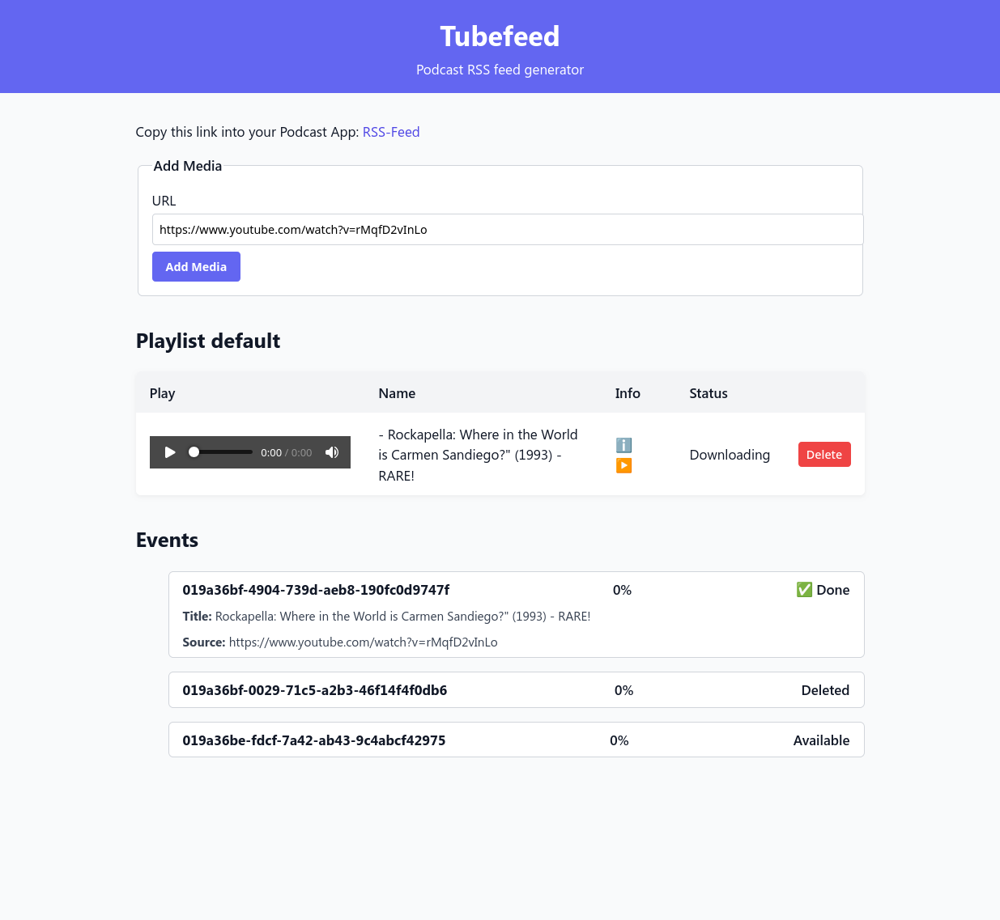

# Tubefeed

Create Podcast Feeds from YouTube Videos

## How to run

~~~sh
docker build -t tubefeed .
docker run -p 8091:8091 -v $PWD/config:/app/config -v $PWD/audio:/app/audio -e EXTERNAL_URL=localhost:8091 tubefeed
~~~

Go to http://localhost:8091

## Features

* Create audio-only Podcast feeds from Youtube Videos
* Organize your Podcasts in multiple playlist
* Webapp with htmx for a smooth and modern experience
* Provides REST-API for all your automation needs
* Database Support: SQLite

## Development

* Generate sqlc queries with `make generate`

## Media

